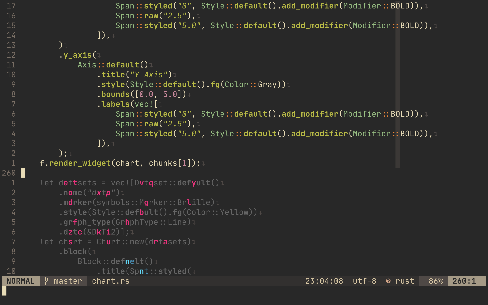
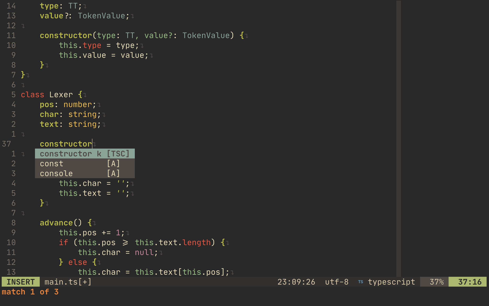
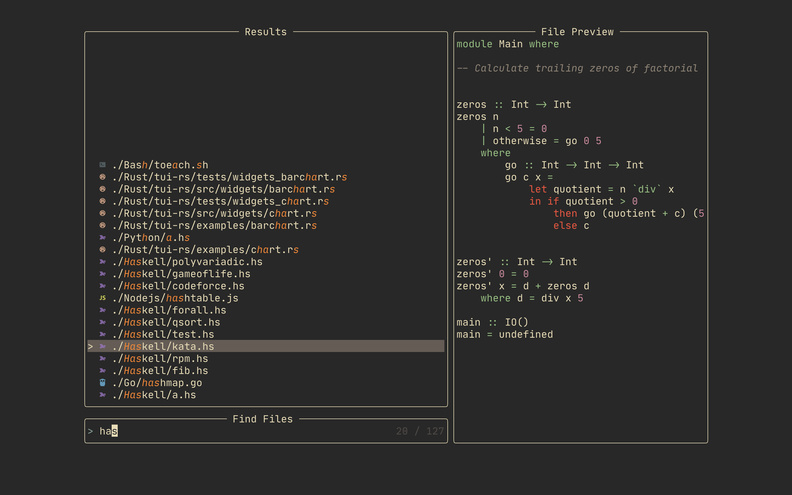

# 📝 Neovim config


My minmal lua-based neovim config. Looks pretty either!
Feel free to do whatever you want with it.

## Plugins

> Plugin manager - [Packer](https://github.com/wbthomason/packer.nvim)

🎨 Color theme is generated by [pywal](https://github.com/dylanaraps/pywal)

- [delimitMate](https://github.com/Raimondi/delimitMate) - Automatic closing of quotes, parenthesis, brackets, etc
- [nvim-treesitter](https://github.com/nvim-treesitter/nvim-treesitter) - Syntax highlighting
- [vim-commentary](https://github.com/tpope/vim-commentary) - Comment stuff out
- [vim-multiple-cursors](https://github.com/terryma/vim-multiple-cursors) - Multiple cursors
- [toggleterm](https://github.com/akinsho/toggleterm.nvim) - Terminal toggle
- [alpha-nvim](https://github.com/goolord/alpha-nvim) - Startup screen
- [code runner](https://github.com/CRAG666/code_runner.nvim) - The best code runner you could have
- [nvim-tree](https://github.com/kyazdani42/nvim-tree.lua) - File explorer
- [telescope](https://github.com/nvim-telescope/telescope.nvim) - Fuzzy finder over lists
- [wilder](https://github.com/gelguy/wilder.nvim) - Enhanced wildmenu
- [coc](https://github.com/neoclide/coc.nvim) - Autocompletion
- [hop](https://github.com/phaazon/hop.nvim) - Easymotion
- [lualine](https://github.com/nvim-lualine/lualine.nvim) - Status line
- [VimTeX](https://github.com/lervag/vimtex) - LaTeX support
- [pywal.nvim](https://github.com/AlphaTechnolog/pywal.nvim) - Neovim pywal integration
- [vim-signature](https://github.com/kshenoy/vim-signature) - Plugin to place, toggle and display marks.

## Install

> Neovim >= 0.5 is required.

⚠️ Note that this will replace your current config.

```bash
git clone https://github.com/metafates/Neovim.git ~/.config/nvim
```

Then open Neovim and run :PackerSync to install plugins.
Be sure to use one of the [nerdfonts](https://github.com/ryanoasis/nerd-fonts) to show icons properly

## Keybinds

> Leader key is `,` (ascii comma)

### Normal Mode

`<Leader>r` - run the current file using [code runner](https://github.com/CRAG666/code_runner.nvim)\
`<Leader>f` - telescope find files\
`<Leader>F` - telescope grep search\
`<Leader>t` - toggle terminal\
`<Leader>w` - save (:w)\
`<Leader>q` - quit (:q)\
`<Leader>m` - toggle file tree\
`f` - easymotion forwards\
`F` - easymotion backwards\
`gcc` - comment out a line\
`<C-n>` - spawn cursor on the same word

### Insert Mode

`jj` - exit insert mode

### Visual Mode

`gc` - comment out a selection\
`<C-n>` - spawn cursors on each line of the selected text

## Commands

`:CRFiletype` - open config file for [code runner](https://github.com/CRAG666/code_runner.nvim)

## Files Structure

```bash
├── init.lua                    # loads modules
└─ lua
    ├── colors                  # stuff related to colors (theme)
    │   └── init.lua  
    ├── core                    # core modules
    │   ├── mappings.lua
    │   ├── options.lua
    │   ├── autocmd.lua
    │   ├── globals.lua
    │   └── settings.lua
    ├── plugins
    │   ├── configs             # configs related to the specific plugins
    │   │   └── ...
    │   └── init.lua            # plugins list
    └── utils                   # utils functions
        └── init.lua
```

## Screenshots




