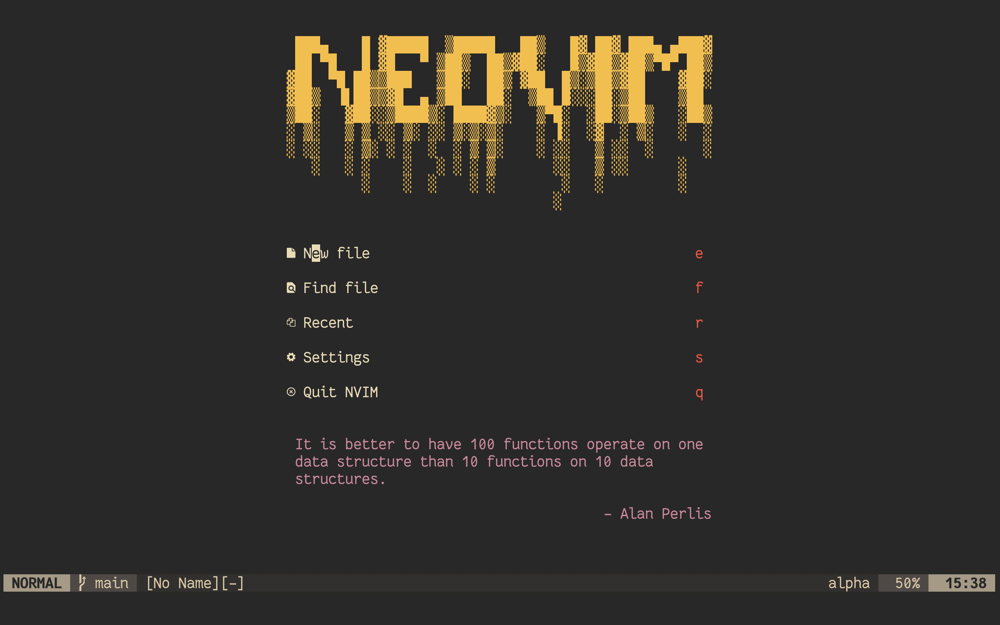

# 📝 Neovim config

My lua-based neovim config

Plugin manager - [packer](https://github.com/wbthomason/packer.nvim)

## Keybinds

Leader key is ',' (ascii coma)

Normal mode

`<Leader>f` - project fuzzy search
`<Leader>F` - telescope grep search
`<Leader>t` - toggle terminal
`<Leader>w` - save file
`<Leader>q` - save and quit
`f` - easymotion forwards
`F` - easymotion backwards

Insert mode

`jj` - exit insert mode

## Commands

`gcc` - comment out a line

